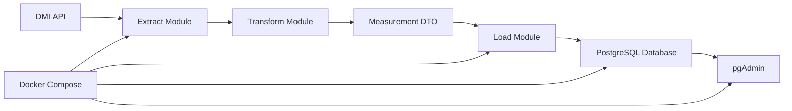

# Miljødata-projekt

Dette projekt er en ETL-pipeline til indsamling, transformation og lagring af miljødata fra Danmarks Meteorologiske Institut (DMI). Data hentet fra DMI's åbne API bliver normaliseret og gemt i en PostgreSQL-database, så det kan bruges til videre analyse, rapportering eller visualisering.

## Formål

Projektet har til formål at:
- hente miljødata fra en ekstern datakilde
- rydde og strukturere data i et ensartet format
- transformere rådata til datamodels, der passer til database-lagring
- gemme data i PostgreSQL
- gøre projektet nemt at køre lokalt via Docker og testbar via pytest

## Oversigt over løsningen

Projektet består af fire hovedfaser:

1. Extract
   - Henter rå data fra DMI API
2. Transform
   - Normaliserer data til interne DTO-objekter
3. Load
   - Gemmer metadata og målinger i PostgreSQL
4. Orchestration
   - Kører hele ETL-flowet via app.main

## Teknologier

- Python 3.12
- PostgreSQL 16
- psycopg
- requests
- pytest
- Docker / Docker Compose
- pgAdmin 4
- Mermaid (til dokumentationsdiagrammer)

## Projektstruktur

```text
environment_data_project/
├── app/
│   ├── __init__.py
│   ├── calculator.py
│   ├── database.py
│   ├── extract.py
│   ├── load.py
│   ├── main.py
│   └── transform.py
├── tests/
│   ├── integration/
│   └── unit/
├── pgadmin/
│   └── servers.json
├── .devcontainer/
│   ├── devcontainer.json
│   ├── Dockerfile
│   └── devcontainer-lock.json
├── .dockerignore
├── .env
├── .gitignore
├── docker-compose.yml
├── Dockerfile
├── requirements.txt
├── requirements-dev.txt
└── README.md
```

## Arkitektur



## Datamodeller

Projektet bruger en dataklasse til at repræsentere målinger:

- MeasurementDTO
  - source_id
  - timestamp
  - temperature
  - humidity
  - co2_ppm
  - particulate_matter_pm25

Derudover oprettes der database-tabeller til:
- dim_sources
- fact_measurements

## Database

Projektet opretter automatisk tabeller i PostgreSQL ved start af ETL-pipeline.

### dim_sources
Gemmer metadata om kilder:

- source_id
- source_name
- source_type

### fact_measurements
Gemmer faktisk måledata:

- measurement_id
- source_id
- timestamp
- temperature
- humidity
- co2_ppm
- particulate_matter_pm25

## Konfiguration

Miljøvariabler ligger i `.env`:

```env
POSTGRES_DB=postgres_db
POSTGRES_USER=admin
POSTGRES_PASSWORD=password
POSTGRES_HOST=db
POSTGRES_PORT=5432
PGADMIN_USER_EMAIL=admin@example.com
PGADMIN_PASSWORD=password
```

## Kør projektet

### 1. Klon repositoryet

```bash
git clone https://github.com/dit-brugernavn/environment_data_project.git
cd environment_data_project
```

### 2. Start med Docker Compose

```bash
docker compose up run --build app
```

Dette starter:
- Python-applikationen
- PostgreSQL
- pgAdmin

pgAdmin er tilgængelig på:
- http://localhost:8080

## Kør tests

```bash
docker compose run --build --rm tests
```


## Opgaveflow i projektet

1. Hent data fra DMI API
2. Parse JSON-responsen
3. Transformér rådata til DTO'er
4. Gem kildeinformation i dim_sources
5. Gem målinger i fact_measurements
6. Valider resultater via tests

## Testning

Projektet inkluderer både:
- unit tests
- integration tests

Testområder omfatter blandt andet:
- databaseforbindelse
- transformeringslogik
- load-logik
- main-flow
- ekstraktionslogik

## Noter

- Projektet er designet til at være nemt at udvide med flere datakilder
- PostgreSQL og pgAdmin kører via Docker Compose
- DMI API'en anvendes som eksternt datagrundlag
- Projektet er velegnet til videre udvikling som ETL- eller dataengineering-projekt

## Forfatter

Mie Louise Nielsen
