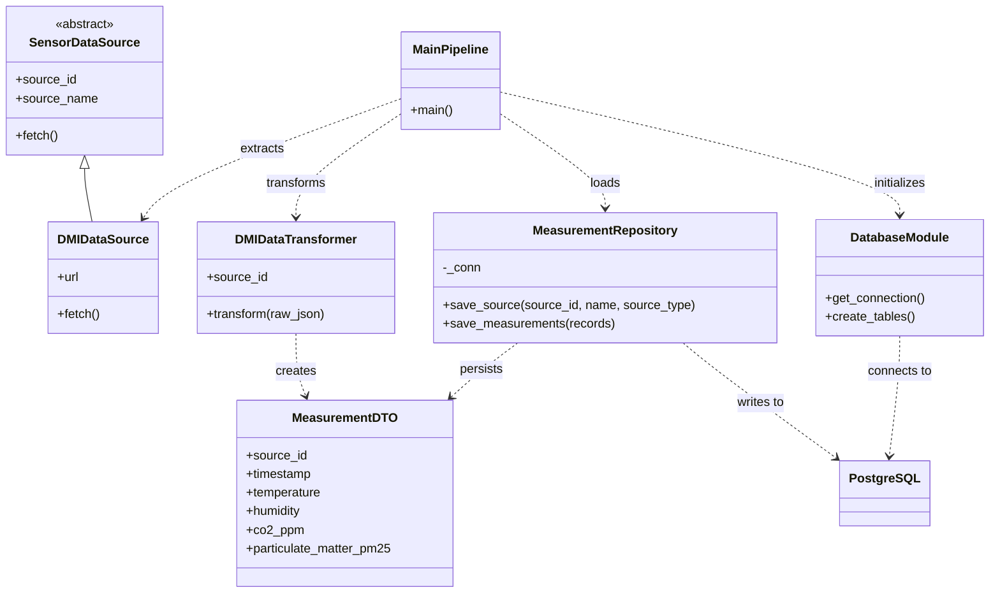
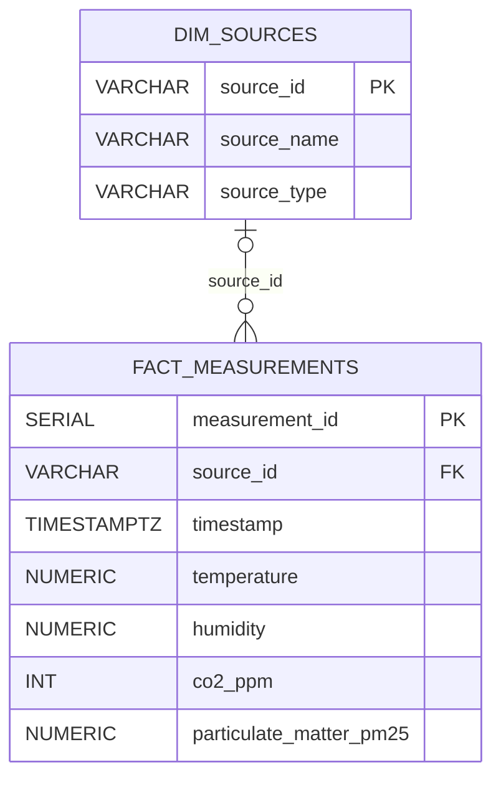

# Environment Data Project

## Abstract

This project implements a Python-based extract, transform, and load (ETL) pipeline
for environmental observations obtained from the Danish Meteorological Institute
(DMI) open data API. The pipeline retrieves API data, maps selected observations
to typed data-transfer objects, and persists them in a PostgreSQL database.
Docker Compose provides a reproducible environment for the application,
database, pgAdmin, and automated tests.

The repository is intended as an educational demonstration of API integration,
relational data modelling, separation of concerns, containerized development,
and automated testing. It is not a general-purpose data warehouse or a
production-hardened ingestion service.

## Project Description

The application processes DMI observation data using four ETL stages:

1. **Extract:** retrieve a JSON response from the configured DMI endpoint.
2. **Transform:** group supported temperature and humidity observations by
   timestamp and map them to `MeasurementDTO` objects.
3. **Load:** register the source and upsert measurements in PostgreSQL.
4. **Verify:** run automated unit and database integration tests.

The current transformer handles temperature identifiers `temp` and `temp_dry`,
and humidity identifiers `rh`, `humidity`, and `humidity_past1h`. Although the
database schema includes columns for carbon dioxide and PM2.5, the current
transformation logic does not populate those fields; they are reserved for
future extensions.

## Software Architecture

The application uses a layered ETL architecture with a central orchestration
module and separate extraction, transformation, persistence, and database
initialization responsibilities.



`app/main.py` coordinates the pipeline. `app/extract.py` defines the abstract
`SensorDataSource` interface and the DMI implementation. `app/transform.py`
converts the API payload into immutable `MeasurementDTO` instances.
`app/load.py` encapsulates SQL persistence in `MeasurementRepository`, while
`app/database.py` manages PostgreSQL connections and initializes the schema.
This separation isolates API access, data mapping, and storage so that each
stage can be tested independently.

## Database Design

The schema uses a source dimension and a measurement fact table. This structure
stores source metadata separately from timestamped observations and provides
referential integrity between them.

### Entity Relationship Diagram



Each measurement may reference zero or one source because `source_id` is a
nullable foreign key. A source may be associated with zero or more measurements.
The `timestamp` column is required. The database also defines a unique
constraint on `(source_id, timestamp)` to support idempotent loading for
measurements with a source identifier.

| Table | Column | Data type | Constraint or purpose |
|---|---|---|---|
| `dim_sources` | `source_id` | `VARCHAR(50)` | Primary key |
| `dim_sources` | `source_name` | `VARCHAR(100)` | Required source name |
| `dim_sources` | `source_type` | `VARCHAR(50)` | Required source classification |
| `fact_measurements` | `measurement_id` | `SERIAL` | Primary key |
| `fact_measurements` | `source_id` | `VARCHAR(50)` | Nullable foreign key to `dim_sources.source_id` |
| `fact_measurements` | `timestamp` | `TIMESTAMPTZ` | Required observation time |
| `fact_measurements` | `temperature` | `NUMERIC(5, 2)` | Temperature in degrees Celsius |
| `fact_measurements` | `humidity` | `NUMERIC(5, 2)` | Relative humidity |
| `fact_measurements` | `co2_ppm` | `INT` | Carbon dioxide concentration, parts per million |
| `fact_measurements` | `particulate_matter_pm25` | `NUMERIC(6, 2)` | PM2.5 concentration |

The schema is created by `create_tables()` when the application starts.
`MeasurementRepository` uses the unique source-and-timestamp key to update
temperature and humidity values when a matching observation already exists.

## Repository Structure

```text
environment_data_project/
├── app/
│   ├── __init__.py
│   ├── calculator.py
│   ├── database.py
│   ├── extract.py
│   ├── load.py
│   ├── main.py
│   └── transform.py
├── pgadmin/
│   └── servers.json
├── tests/
│   ├── integration/
│   │   └── test_postgres.py
│   └── unit/
│       ├── test_calculator.py
│       ├── test_database.py
│       ├── test_extract.py
│       ├── test_load.py
│       ├── test_main.py
│       └── test_transform.py
├── .env
├── docker-compose.yml
├── Dockerfile
├── .gitignore
├── requirements-dev.txt
└── requirements.txt
```

## Build, Configuration, and Execution

### Prerequisites

- Git
- Docker Desktop (or Docker Engine) with the Docker Compose v2 plugin

### Obtain the source code

```bash
git clone https://github.com/mielouise/environment_data_project.git
cd environment_data_project
```

### Configure environment variables

Docker Compose reads connection and pgAdmin settings from a `.env` file in the
repository root. Create this file locally if it is not already present. Do not
commit credentials or other secrets to version control.

```env
POSTGRES_HOST=db
POSTGRES_PORT=5432
POSTGRES_DB=<database_name>
POSTGRES_USER=<database_user>
POSTGRES_PASSWORD=<database_password>

PGADMIN_USER_EMAIL=<pgadmin_email>
PGADMIN_PASSWORD=<pgadmin_password>
```

Use non-empty values in place of the placeholders. These variables configure
the PostgreSQL container, the application connection, and the pgAdmin login.

### Run the ETL application

```bash
docker compose up --build app
```

Compose starts the PostgreSQL service and waits for its health check before
starting the application. The application initializes the tables, requests data
from the DMI endpoint configured in `app/main.py`, transforms the supported
observations, and writes the source and measurement records to PostgreSQL.
Because the command uses `--rm`, the one-off application container is removed
when it exits. The named PostgreSQL volume retains the database data.

### Access pgAdmin

Start PostgreSQL and pgAdmin with:

```bash
docker compose up -d pgadmin
```

When pgAdmin is ready, open `http://localhost:8080` and sign in with the
`PGADMIN_USER_EMAIL` and `PGADMIN_PASSWORD` values from `.env`. The server
connection is configured in `pgadmin/servers.json`.

### Stop the services

```bash
docker compose down
```

This stops and removes the containers but retains data in named volumes. To
remove the PostgreSQL and pgAdmin volumes as well, use
`docker compose down --volumes`; this permanently deletes their stored data.

## Testing

The project uses Pytest for unit and integration tests. Unit tests cover
individual application components. The PostgreSQL integration test requires a
running database, which the Compose test service starts and health-checks.

Run the test suite in the configured container environment with:

```bash
docker compose run --build --rm tests
```

The test service runs `pytest --cov=app`, executing the tests and reporting
coverage for the application package. A successful run requires Docker to be
available and the environment variables described above to be configured.

## Technology Stack

| Technology | Role |
|---|---|
| Python 3.12 | ETL application and tests |
| PostgreSQL 16 | Relational persistence |
| Psycopg | PostgreSQL connectivity |
| Requests | HTTP requests to the DMI API |
| Docker Compose | Local multi-service orchestration |
| pgAdmin | Database administration |
| Pytest and pytest-cov | Automated tests and coverage reporting |

## Limitations and Future Work

The current implementation retrieves the endpoint URL defined in `app/main.py`
without additional query parameters. The transformer currently maps temperature
and humidity observations only. It does not yet support pagination, scheduled
execution, retries, historical backfills, or generic parameter-value storage.
These are potential extensions rather than features of the current system.

## Author

Mie Louise Nielsen
GitHub: [mielouise](https://github.com/mielouise)

## License and Intended Use

This project was developed for educational purposes. No separate license file
is currently included in the repository.
