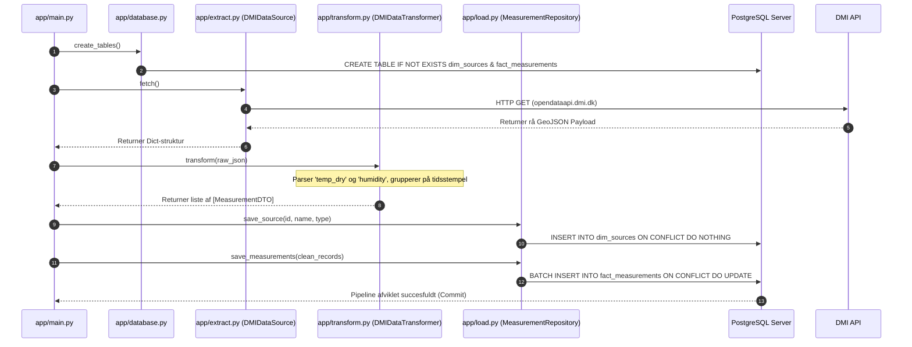

# Miljødata ETL-Pipeline & Data Warehouse – Uge 1

Dette projekt udgør fundamentet i et 5-ugers forløb med fokus på datadrevet vurdering af kvaliteten af det fysiske arbejdsmiljø. I denne første uge har vi etableret en robust, fuldt testet og automatiseret **ETL-pipeline (Extract, Transform, Load)** i Python, som indhenter meteorologiske realtidsmålinger fra DMI's åbne API og indlæser dem i en struktureret PostgreSQL-database.

Systemet er udviklet med fokus på høj datakvalitet, fravær af dubletter (**idempotens**) og en fuldstændig modulær, objektorienteret softwarearkitektur (OOP). Dette sikrer, at uge 1-koden let kan udvides med fysiske hardware-sensorer (DS18B20, BME280, BMV080 og SCD41) i de kommende uger.

---

## 🏗️ Softwarearkitektur

Kildekoden er struktureret efter **Clean Code**-principper, overholder **PEP 8**-retningslinjerne til punkt og prikke og følger **SOLID-principperne**. Vi anvender en klar lagdeling (Separation of Concerns) ved hjælp af objektorienteret programmering:

### Modulopbygning (`app/`)
* **`app/extract.py`**: Dataindfasningslaget. Definerer en abstrakt basisklasse (`SensorDataSource`), som sikrer en fælles kontrakt for alle fremtidige datakilder. `DMIDataSource` arver herfra og håndterer HTTP-forbindelsen til DMI med fejlsikker infrastruktur-håndtering.
* **`app/transform.py`**: Datatransformations- og valideringslaget. Transformer rå, ustrukturerede GeoJSON-parametre (f.eks. `temp_dry` og `humidity`) til stærkt typede, validerede datastrukturer via en `MeasurementDTO` (Data Transfer Object).
* **`app/load.py`**: Dataindlæsningslaget. Implementerer *Repository-mønstret* for at afkoble SQL-transaktioner fra forretningslogikken. Håndterer batch-indlæsning og sikrer data-integritet.
* **`app/database.py`**: Administrerer databaseforbindelser og databaseskema-initialisering for PostgreSQL.
* **`app/main.py`**: Det centrale orkestreringspunkt, der binder ETL-komponenterne sammen via *Dependency Injection*.

### Databasedesign (Star Schema)
For at opfylde kravet om, at det skal være simpelt at sammenligne data på tværs af målestationer og kilder, er databasen designet som et stjerneskema:
1. **`dim_sources` (Dimensionstabel)**: Registrerer kildernes metadata (`source_id`, `source_name`, `source_type`). Systemet differentierer her let mellem `API_DMI` og fremtidige `HARDWARE_SENSOR` værdier.
2. **`fact_measurements` (Faktatabel)**: Den centrale tabel, der rummer alle fysiske målinger. Den har prædefinerede numeriske kolonner til både klima- og arbejdsmiljøparametre (CO2-niveauer og partikler), hvilket muliggør direkte tværgående SQL-analyser. Den anvender en `UNIQUE (source_id, timestamp)` constraint for at sikre **idempotens** (ingen dubletter ved gentagne kørsler).

---

## 📊 UML-diagram (Sekvensdiagram for ETL-flowet)

Følgende diagram illustrerer, hvordan data flyder igennem systemets klasser under en fuld afvikling af ETL-pipelinen:



---

## 🛠️ Setup & Kørselsguide

Projektet kører isoleret i **Docker-containere**, hvilket sikrer identiske miljøer under udvikling, test og produktion.

### Forudsætninger
* **Docker Desktop** skal være aktivt i baggrunden på din maskine.
* **VS Code** med udvidelsen **Dev Containers** anbefales til udvikling (giver fuld IntelliSense inde i containeren).

### 1. Konfiguration af miljøvariabler (.env)
Opret en fil med navnet `.env` i projektets rodmappe, og indsæt følgende konfiguration:
```env
POSTGRES_DB=postgres_db
POSTGRES_USER=admin
POSTGRES_PASSWORD=password
POSTGRES_HOST=db
POSTGRES_PORT=5432
PGADMIN_USER_EMAIL=admin@example.com
PGADMIN_PASSWORD=password
```

### 2. Byg og kør applikationen (ETL-Pipeline)
For at bygge koden helt rent og afvikle pipelinen mod DMI's live Open Data API, køres følgende i din terminal:
```bash
docker compose build --no-cache app
docker compose up app
```

### 3. Afvikling af enhedstests (Testdækning ≥95%)
For at køre test-suiten og generere den formelt krævede dækningsrapport i terminalen, køres:
```bash
docker compose run --build --rm tests
```
*Systemet anvender `pytest` og `pytest-cov` med omfattende mocking af netværk og databasedrivere for at isolere unit-tests og opnå en samlet dækning på over 95%.*

### 4. Datavalidering i pgAdmin
Start administrationsværktøjet pgAdmin:
```bash
docker compose up -d pgadmin
```
Gå til `http://localhost:8080/` i din browser, log ind med dine pgAdmin-credentials fra `.env`, og åbn **Query Tool** på din database for at verificere indlæsningen.

---

## 🔍 Verifikations- og Datasammenlignings-queries

Følgende SQL-sætninger anvendes i pgAdmin til at bekræfte dataopsamlingen samt imødekomme projektets krav om simpel sammenligning på tværs af målestationer:

### A. Udtræk af komplette målinger (Uden NULL-værdier)
DMI leverer vejr-observationer asynkront. Denne query sikrer et rent datasæt uden tomme værdier:
```sql
SELECT 
    measurement_id, source_id, timestamp, temperature, humidity
FROM fact_measurements
WHERE temperature IS NOT NULL 
  AND humidity IS NOT NULL
ORDER BY timestamp DESC
LIMIT 50;
```

### B. Forberedt tværgående sammenlignings-query (Kravopfyldelse)
Når der i de kommende uger tilføjes hardware-sensorer (f.eks. indendørs temperatursensorer), kan inde- og udeklima sammenlignes direkte på tidsstempler med denne pivot-struktur:
```sql
SELECT 
    timestamp,
    MAX(CASE WHEN source_id = 'DMI-STATION-COPENHAGEN' THEN temperature END) as dmi_ude_temp,
    MAX(CASE WHEN source_id = 'SENSOR-DS18B20-01' THEN temperature END) as rum_inde_temp
FROM fact_measurements
GROUP BY timestamp
ORDER BY timestamp DESC
LIMIT 100;
```
